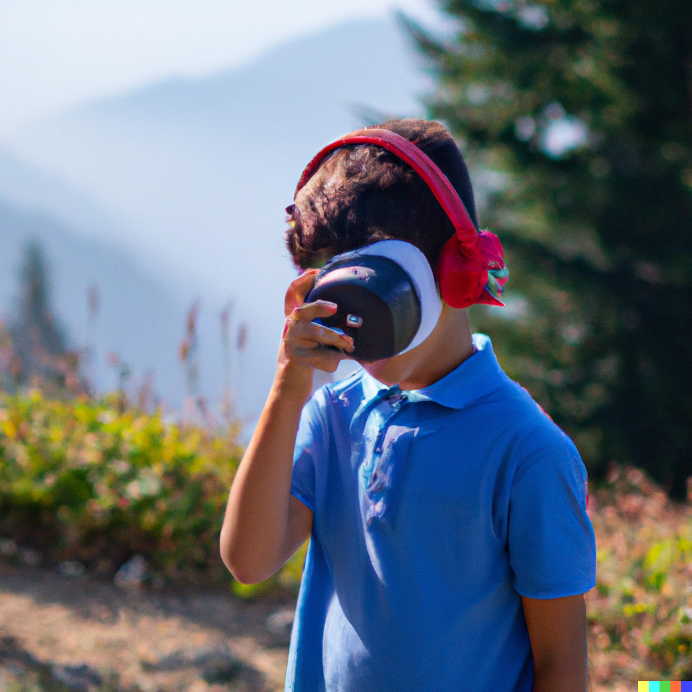

# Image Captioning and Text-to-Speech Application
<p align="center">
   
</p>
This project is an Image Captioning and Text-to-Speech application that generates descriptive captions for uploaded images and converts the captions into speech. It utilizes state-of-the-art models for image captioning and text-to-speech synthesis, providing a seamless user experience for visually impaired individuals, content creators, or anyone interested in exploring multimodal AI applications.

## Features

- **Image Captioning**: The application employs [Salesforce's BLIP](https://huggingface.co/Salesforce/blip-image-captioning-base) image captioning model, which has been trained on large-scale image-caption datasets. It generates accurate and contextually relevant captions for uploaded images, allowing users to understand the content of the image without relying solely on visual perception.

- **Text-to-Speech Synthesis**: [Microsoft's SpeechT5](https://huggingface.co/microsoft/speecht5_tts) model is employed for text-to-speech synthesis, converting the generated captions into natural-sounding speech. The SpeechT5 model incorporates advanced techniques for speech generation, producing high-quality and expressive speech output.

- **Multiple Input Options**:  Supports image upload from local devices and URL input for images hosted online, offering flexibility in image selection.

- **Real-time Processing**: Performs image captioning and text-to-speech synthesis in real-time, delivering quick and responsive results.

- **User-friendly Interface**: Built using the Streamlit framework, the application provides clear instructions, intuitive image upload options, and visually appealing visualizations for a seamless and accessible user experience.

## Try it online
Try the Image Captioning and Text-to-Speech application online by visiting the deployed Streamlit app:

[Live Demo](https://alimtleuliyev-image-to-audio-app-xs26qi.streamlit.app)

```
Note: In case the application runs out of memory during usage, you can try rebooting the app to free up resources and ensure optimal performance.
```

## Installation

To run the Image Captioning and Text-to-Speech application locally, follow these steps:

1. Clone the repository:

   ```shell
   git clone https://github.com/your-username/your-repo.git
   ```
2. Install the required dependencies using pip:
   ```shell
   pip install -r requirements.txt
   ```
3. Run the application:
   ```shell
   streamlit run app.py
   ```
   The application will be accessible in your web browser at http://localhost:8501.

## Contributions and Support

Contributions, bug reports, and feature requests are welcome! If you encounter any issues or have suggestions for improvements, please open an issue on the GitHub repository. You can also reach out to the project maintainer, Alim Tleuliyev, at alim.tleuliyev@nu.edu.kz for further assistance or inquiries.
   
